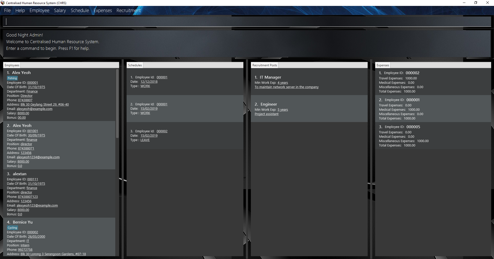

= Centralised Human Resource System (CHRS)
ifdef::env-github,env-browser[:relfileprefix: docs/]

image:https://api.codacy.com/project/badge/Grade/b9c9b25a8f144d94a8ac84b66110915c[link="https://app.codacy.com/app/zhihong8888/main?utm_source=github.com&utm_medium=referral&utm_content=CS2113-AY1819S1-T16-4/main&utm_campaign=Badge_Grade_Dashboard"]
https://travis-ci.org/CS2113-AY1819S1-T16-4/main[image:https://travis-ci.org/nusCS2113-AY1819S1/addressbook-level4.svg?branch=master[Build Status]]
https://ci.appveyor.com/project/LimYiSheng/main-mq9f4/branch/master[image:https://ci.appveyor.com/api/projects/status/qyjcn8xybhessr25/branch/master?svg=true[Build status]]
https://coveralls.io/github/CS2113-AY1819S1-T16-4/main?branch=master[image:https://coveralls.io/repos/github/CS2113-AY1819S1-T16-4/main/badge.svg?branch=master[Coverage Status]]

ifdef::env-github[]

endif::[]

ifndef::env-github[]
image::images/Ui.png[width="600"]
endif::[]

* *Centralised Human Resource System (CHRS)* is a desktop application. It has a GUI but most of the user interactions happen using a CLI (Command Line Interface).
* CHRS is targeted at the *Human Resource (HR) department*.
* As the HR department requires access to various information of each employee, it may be a hassle for them to obtain the required information if the information are stored in various different systems and/or databases.
* Therefore, CHRS aims to help the HR department store all relevant information to each employee within one system.
* CHRS is developed by group T16-4 from the module CS2113 in National University of Singapore (NUS).

== Site Map

* <<UserGuide#, User Guide>>
* <<DeveloperGuide#, Developer Guide>>
* <<AboutUs#, About Us>>
* <<ContactUs#, Contact Us>>

== Acknowledgements

* Some parts of this sample application were inspired by the excellent http://code.makery.ch/library/javafx-8-tutorial/[Java FX tutorial] by
_Marco Jakob_.
* Libraries used: https://github.com/TestFX/TestFX[TextFX], https://bitbucket.org/controlsfx/controlsfx/[ControlsFX], https://github.com/FasterXML/jackson[Jackson], https://github.com/google/guava[Guava], https://github.com/junit-team/junit5[JUnit5]
* This application was built using the source code found in https://github.com/se-edu/addressbook-level4[AddressBook-level4] by SE-EDU.

== Licence : link:LICENSE[MIT]
